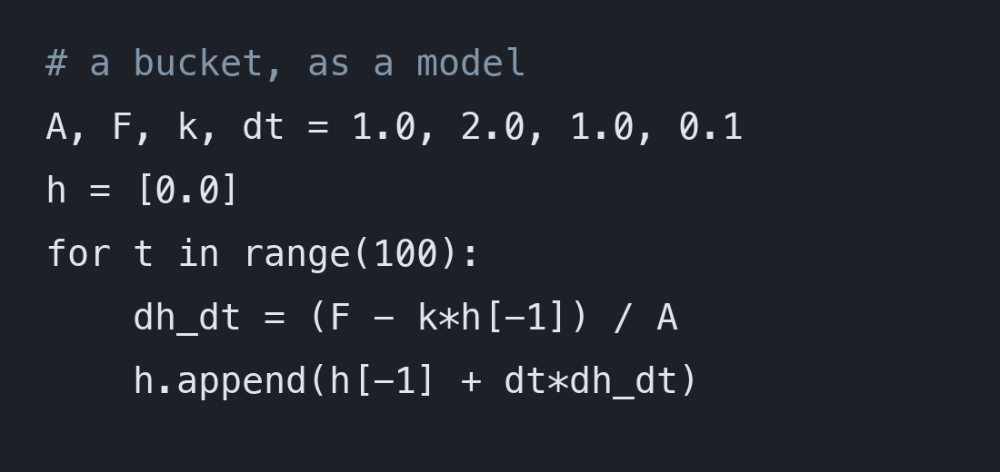
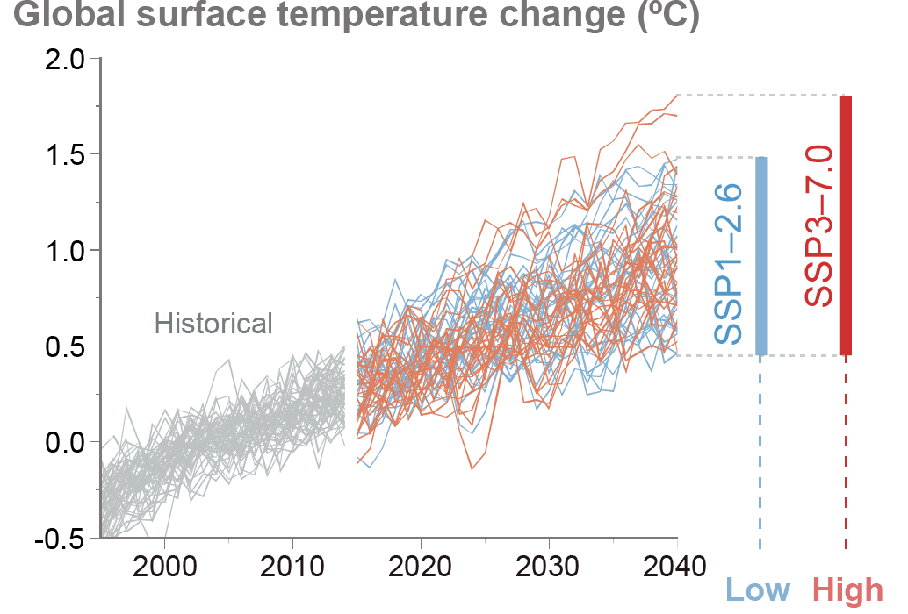
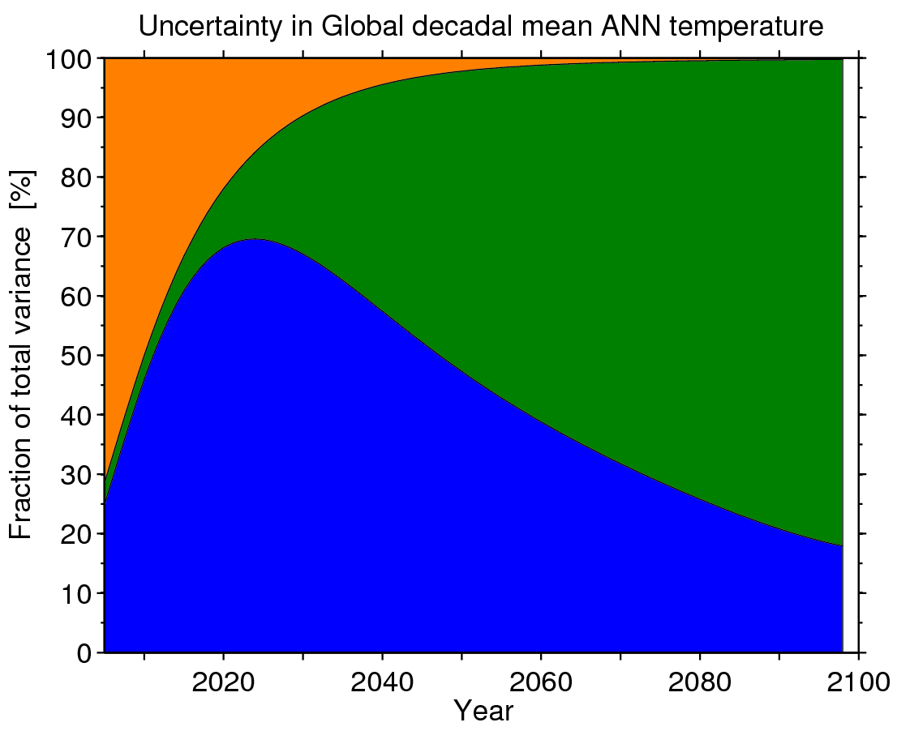

## Intro and logistics

- Time: Thursdays 10:10–12:40 · FRM 315 (The Forum)
- Instructor: Dhruv Balwada (dbalwada@ldeo.columbia.edu)
- TAs: **Prani Nalluri** (pan2121) · **Chandanie Kutwaru** (ck3397)
- Office hours: **TBD** (TAs will organize)
- We will work using Courseworks + **[the course website](https://dhruvbalwada.github.io/intro-climate-modeling-fall2026/)** ↓

{width="22%" fig-align="center"}

::: {.notes}
Brief self-intro, then straight into the work.
:::

## The work: labs, homeworks, project {.smaller}

| Component | Weight | Rhythm |
|---|---|---|
| Participation/attendance | 5% | in-class presence |
| Labs | 10% | in class, almost every week — submit by end of week |
| Homework (5) | 50% | ~every two weeks |
| Project proposal | 10% | title **Oct 9** · proposal **Oct 23** |
| Final project | 25% | present Dec 10/17 · notebook due **Dec 18** |

#### Homework submission process
All code in your own private GitHub repo; submitting = posting the folder or notebook link on Courseworks. 

::: {.notes}
Flag the early project-title date (Oct 9!). Late policy: 10%/day, one free late HW. 
:::

## Using AI in this course {.smaller}

- **Allowed** 
  - **Google Gemini** (free through CUIT); ChatGPT or Claude are fine too. 
- **Default to asking it to teach you, not to do it for you.** A standing prompt that works:

  > *"Never give me corrected code or direct syntax fixes. Explain the concept I'm missing."*

- **Good at:** explaining error messages, syntax, library APIs, what a function does
- **Bad at:** judging scientific correctness, choosing the right analysis, subtle bugs, whether a result "looks right"
- You are responsible for understanding everything you submit and for the errors that AI may make. 

## Before we start {.smaller}

1. Roughly what sets the Earth's average temperature? *(could you explain it to a friend?)*
2. Do you remember what "climate sensitivity" means?
3. Have you come across **ordinary differential equations** — in any course?
4. Have you written **Python** this year? *…keep your hand up if you've used it on climate or environmental data*
5. Have you used **git/GitHub** before?

::: {.notes}
Ungraded diagnostic — no judgment framing: "a year since GR5001 is a long time; that's expected." Q3 calibrates the math pacing of weeks 2–3; Q4's second stage tells you how much xarray scaffolding labs need; Q5 tells the TAs how hands-on Lab 0a must be. Jot rough counts right after class.
:::

# Lab 0a · Getting set up {background-color="#1a3a5c"}

# Lab 0b · Python {background-color="#1a3a5c"}

# 1 · What is climate? {background-color="#1a3a5c"}

## Weather is the state. Climate is the distribution. {.smaller}

- **Weather**: the value right now — a random variable, unpredictable in detail beyond ~2 weeks
- **Climate**: the *distribution* those values are drawn from — mean, variability, **tails** — estimated over a chosen period
- Climate change = the distribution shifting, widening, or reshaping

## 

{.r-stretch fig-align="center"}

::: {style="font-size:0.35em; color:#888;"}
IPCC AR6 WG1, Figure SPM.1 (2021)
:::

## 

{.r-stretch fig-align="center"}

::: {style="font-size:0.35em; color:#888;"}
IPCC AR6 WG1, Figure SPM.8, panel (a) (2021)
:::

# 2 · What is a model? {background-color="#1a3a5c"}

## A model is… {.smaller}

:::: {.columns}
::: {.column width="50%"}
{height="185px" fig-align="center"}

<em>physical</em> — a scale model of a building

:::
::: {.column width="50%"}
{height="185px" fig-align="center"}

<em>abstract</em> — equations, or code (this one is Lab 0d)

:::
::::

- a **simplified representation of a system**, built *for a purpose* — prediction, explanation, communication
- physical (a wind tunnel) or abstract (equations, code); climate models are **budgets** of energy, mass, momentum
- every model has **structure** (the form you chose) and **parameters** (the numbers you fit)
- "best model" is meaningless without "…for what question?"

Photo: Mak Faitre Sownia, CC BY-SA 4.0, via Wikimedia Commons

::: {.notes}
One slide of philosophy, then the labs make it real. The structure/parameters line pays off once everyone's hand-fit differs.
:::

# Lab 0c · The climate of NYC {background-color="#1a3a5c"}

# Lab 0d · Modeling using budgets {background-color="#1a3a5c"}

# 3 · What is uncertainty? {background-color="#1a3a5c"}

## Three reasons a forecast can be wrong {.smaller}

> "It's tough to make predictions, especially about the future."

You just generated all three in the bucket:

- **Initial-condition uncertainty** — you varied $h_0$: matters early, forgotten later *(Earth: today's exact weather)*
- **Model uncertainty** — you varied $k$: parameters (and structure) *(Earth: we don't know exact laws or our models can't be exactly solved)*
- **Scenario uncertainty** — you varied $F$: the pourer decides, not physics *(Earth: emissions)*

Different ones dominate at different horizons. 

::: {.notes}
Every bullet points at something they DID today. Worth saying aloud: by 2100 the biggest uncertainty is the scenario — the largest unknown is a choice.
:::

## How the three trade off with time {.smaller}

:::: {.columns}
::: {.column width="50%"}
{height="320px" fig-align="center"}

Individual model runs under a low and a high scenario. For the next ~20 years the wiggles — <b>internal variability</b> — swamp the difference between scenarios.

:::
::: {.column width="50%"}
{height="320px" fig-align="center"}

Share of the uncertainty in global temperature: <b>internal variability</b> dominates early, <b>model uncertainty</b> mid-century, <b>scenario</b> by 2100.

:::
::::

Left: IPCC AR6 WG1 FAQ 4.1 (2021). Right: Hawkins &amp; Sutton (2009), updated for CMIP5 by E. Hawkins, Climate Lab Book, CC BY-SA 4.0.

::: {.notes}
Map the bucket onto the colours: varying h0 = orange, varying k = blue, varying F = green. Left panel is the intuition (you cannot tell the scenarios apart before ~2040); right panel is the bookkeeping. Closing line: by 2100 the biggest uncertainty is the scenario — the largest unknown is a choice.
:::

## Before you leave

- **Today's notebooks (0b, 0c, 0d)** → saved into your course repo
- **Repo link** → posted on Courseworks *(that's your Lab 0 submission)*
- Didn't finish or want to play around more? Complete at home **before next Thursday** — TAs + office hours can unblock you

. . .

**Next week:** the Earth *is* a bucket — sunlight pours in, infrared drains out, and the level is the heat (temperature). 

