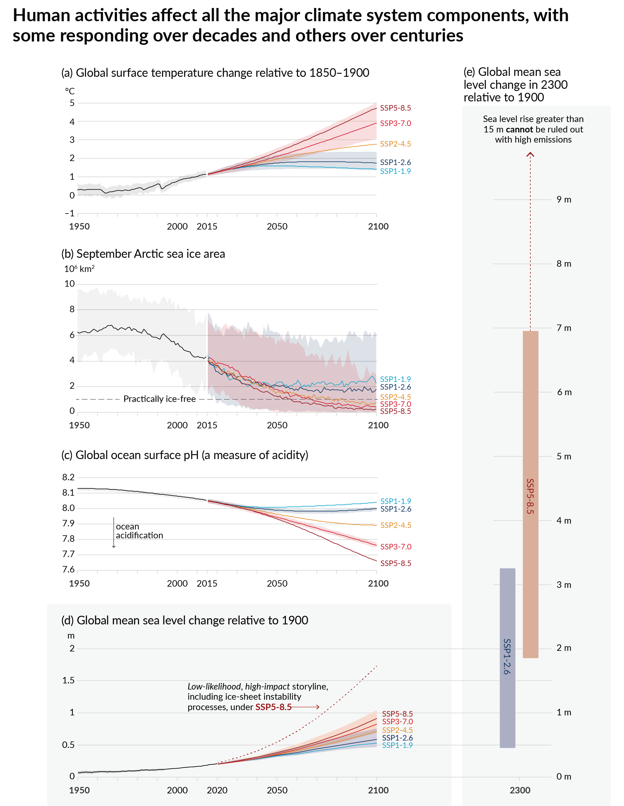
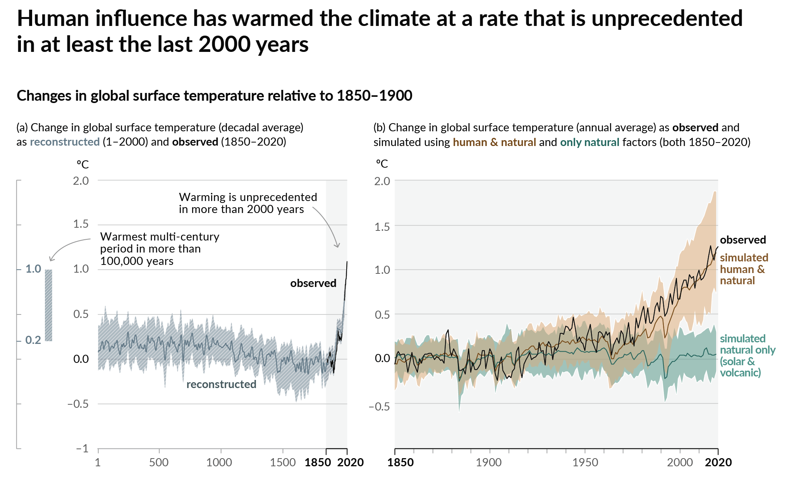

## Intro and logistics

- Time: Thursdays 10:10–12:40 · FRM 315 (The Forum)
- Instructor: Dhruv Balwada (dbalwada@ldeo.columbia.edu)
- TAs: **Prani Nalluri** (pan2121) · **Chandanie Kutwaru** (ck3397)
- Office hours: **TBD** (TAs will organize)
- We will work using Courseworks + **[the course website](https://dhruvbalwada.github.io/intro-climate-modeling-fall2026/)** ↓

{width="22%" fig-align="center"}

::: {.notes}
~8 min incl. 30-s self-intro.
:::

## The work: labs, homeworks, project {.smaller}

| Component | Weight | Rhythm |
|---|---|---|
| Participation/attendance | 5% | in-class presence |
| Labs | 10% | in class, almost every week — submit by end of week |
| Homework (5) | 50% | ~every two weeks |
| Project proposal | 10% | title **Oct 9** · proposal **Oct 23** |
| Final project | 25% | present Dec 10/17 · notebook due **Dec 18** |

#### Homework submission process
All code in your own private GitHub repo; submitting = posting the folder or notebook link on Courseworks. 

::: {.notes}
~6 min. Flag the early project-title date (Oct 9!). Late policy: 10%/day, one free late HW. AI policy: encouraged + disclosed — one line in each submission; understanding is tested in class.
:::

## Before we start {.smaller}

1. Roughly what sets the Earth's average temperature? *(could you explain it to a friend?)*
2. Do you remember what "climate sensitivity" means?
3. Have you come across **ordinary differential equations** — in any course?
4. Have you written **Python** this year? *…keep your hand up if you've used it on climate or environmental data*
5. Have you used **git/GitHub** before?

::: {.notes}
Ungraded diagnostic — no judgment framing: "a year since GR5001 is a long time; that's expected." Q3 calibrates the math pacing of weeks 2–3; Q4's second stage tells you how much xarray scaffolding labs need; Q5 tells the TAs how hands-on Lab 0a must be. Jot rough counts right after class.
:::

# Lab 0a · Getting set up {background-color="#1a3a5c"}

*Laptops out. TAs are circulating. Nobody gets left behind.*

## Lab 0a checklist (~30 min) {.smaller}

Follow the [Lab 0 instructions](https://dhruvbalwada.github.io/intro-climate-modeling-fall2026/labs/lab0a.html) on the course website:

1. **GitHub account** (skip if you have one) → create your **private course repo** `climate-modeling-f26-<uni>` → add me + Prani + Chandanie as collaborators
2. **LEAP hub**: log in at [leap.2i2c.cloud](https://leap.2i2c.cloud/) *(filled the access form? if it fails — hand up)*
3. Start your server, open JupyterLab, run the verification notebook
4. **Submit**: post your repo URL to the Courseworks "Lab 0" assignment

Done early? Help a neighbor — explaining git is the best way to learn it.

::: {.notes}
~30–35 min. Front-loads the setup pain while TAs are in the room instead of leaving it to students alone at home. TAs collect names of anyone without hub access.
:::

## Your toolkit, in one slide {.smaller}

- **JupyterLab** (on the hub): notebooks are cells; `Shift+Enter` runs one; the kernel is the running Python
- **numpy** — arrays and math: `np.cos(...)`, `arr.mean()`
- **matplotlib** — plots: `plt.plot(t, h)`
- **pandas / xarray** — labeled data from files or the cloud: `pd.read_csv(url)`
- AI assistants: **allowed and encouraged** for coding help (disclose it; you must understand what you submit)

We learn these by *using* them — starting right after the break.

::: {.notes}
~5 min max — a map, not a tutorial.
:::

## Break {.center background-color="#2c2c2c"}

*10 minutes*

::: {.notes}
TAs use the break to unblock hub/GitHub stragglers.
:::

# 1 · What is climate? {background-color="#1a3a5c"}

## Weather is the state. Climate is the distribution. {.smaller}

- **Weather**: the value right now — a random variable, unpredictable in detail beyond ~2 weeks
- **Climate**: the *distribution* those values are drawn from — mean, variability, **tails** — estimated over a chosen period (convention: ~30 years)
- Climate change = the distribution shifting, widening, or reshaping — with very different consequences in the tails

::: {.notes}
~5 min abstract; Lab 0b makes it concrete with NYC data in a few minutes.
:::

## Every number on this figure came out of a model

{height="82%" fig-align="center"}

::: {style="font-size:0.35em; color:#888;"}
IPCC AR6 WG1, Figure SPM.8 (2021)
:::

::: {.notes}
"IPCC predicts climate — you've seen figures like this. Observations + models + uncertainty bands. By December you'll know how each ingredient is made."
:::

## …and the past: model spread, observations on top

{height="78%" fig-align="center"}

::: {style="font-size:0.35em; color:#888;"}
IPCC AR6 WG1, Figure SPM.1 (2021)
:::

::: {.notes}
Bands = spread of model ensembles (brown: human+natural; green: natural-only); black = observations. Two beats: models reproduce the past with quantified spread; the obs stay inside the band only with human forcing — that's attribution.
:::

# 2 · What is a model? {background-color="#1a3a5c"}

## A model is… {.smaller}

- a **simplified representation of a system**, built *for a purpose* — prediction, explanation, communication
- physical (a wind tunnel) or abstract (equations, code); climate models are **budgets** of energy, mass, momentum
- every model has **structure** (the form you chose) and **parameters** (the numbers you fit)
- "best model" is meaningless without "…for what question?"

::: {.notes}
~5 min — one slide of philosophy, then the labs make it real. The structure/parameters line pays off in ~15 minutes when everyone's hand-fit differs.
:::

## Lab 0b · The climate of NYC {.smaller}

Open **`lab0b_nyc_climate.ipynb`** *(download from the [Labs page](https://dhruvbalwada.github.io/intro-climate-modeling-fall2026/labs/), upload to your hub)*:

1. Plot 20 years of Central Park temperature → **what is the climate of NYC?**
2. **Fit a 2-parameter model by hand**: $T_0 + A\cos(2\pi(d-201)/365)$ — pick $T_0$ and $A$, check the error, iterate. *What are the units?*
3. When you're happy: **shout out your $T_0$, $A$, RMSE** — we collect them on the board
4. Then: the same NYC from **ERA5** and from a **CMIP6 model** — why are all three different?

::: {.notes}
~30 min. The board collection is the point: same data, same model, different answers = parameter uncertainty, experienced firsthand. Then the punchline in part 4: ERA5 tracks the weather (r≈0.95), the free-running CMIP6 model ignores it (r≈0) — and that's by design; it only owes you the distribution. Discussion prompts are in the notebook.
:::

## Lab 0c · A bucket: adding time {.smaller}

*(board first: a volume budget — in − out = accumulation)*

$$A\,\frac{dh}{dt} = \underbrace{F}_{\text{forcing (external)}} - \underbrace{k\,h}_{\text{drain (the system)}}$$

Open **`lab0c_bucket.ipynb`**:

1. Equilibrium: set $dh/dt=0$ → $h^* = F/k$ — *check the units!*
2. **Fill in the Euler step** and watch the level find its equilibrium
3. Attack your own prediction three ways: vary $h_0$ · vary $k$ · vary $F$

::: {.notes}
~30 min: ~10 on the board (derive the budget slowly — volumes, fluxes, units; which terms are external forcing vs properties of the system), ~20 in the lab. Say the feedback sentence explicitly: fuller → drains harder → that's what makes equilibrium exist. The three experiments set up the closing section.
:::

# 3 · What is uncertainty? {background-color="#1a3a5c"}

## Three reasons a forecast can be wrong {.smaller}

> "It's tough to make predictions, especially about the future."

You just generated all three in the bucket:

- **Initial-condition uncertainty** — you varied $h_0$: matters early, forgotten later *(Earth: today's exact weather)*
- **Model uncertainty** — you varied $k$: parameters (and structure) *(Earth: feedback strengths — and everyone's different $A$ in Lab 0b)*
- **Scenario uncertainty** — you varied $F$: the pourer decides, not physics *(Earth: emissions)*

Different ones dominate at different horizons. *(Week 11 quantifies this for the real Earth.)*

::: {.notes}
~7 min. Every bullet points at something they DID today. Worth saying aloud: by 2100 the biggest uncertainty is the scenario — the largest unknown is a choice.
:::

## Before you leave

- **Lab 0b + 0c notebooks** → saved into your course repo
- **Repo link** → posted on Courseworks *(that's your Lab 0 submission)*
- Didn't finish? Complete at home **before next Thursday** — TAs + office hours can unblock you

. . .

**Next week:** the Earth *is* a bucket — sunlight pours in, infrared drains out, and the level is the temperature. We'll compute where the level settles… and get a spectacularly productive wrong answer.

::: {.notes}
The 255 K derivation + "Earth is a bucket" mapping now OPEN week 2 (parked in topics/_earth_is_a_bucket.qmd).
:::
