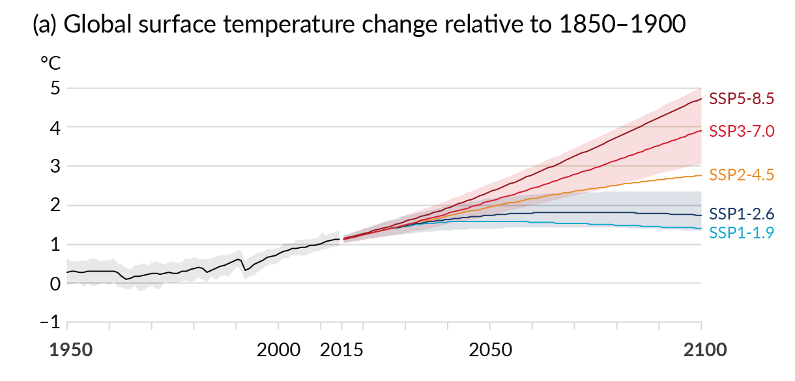

## Intro and logistics

- Time: Thursdays 10:10–12:40 · FRM 315 (The Forum)
- Instructor: Dhruv Balwada (dbalwada@ldeo.columbia.edu)
- TAs: **Prani Nalluri** (pan2121) · **Chandanie Kutwaru** (ck3397)
- Office hours: **TBD** (TAs will organize)
- We will work using Courseworks + **[the course website](https://dhruvbalwada.github.io/intro-climate-modeling-fall2026/)** ↓

{width="22%" fig-align="center"}

::: {.notes}
Brief self-intro, then straight into the work.
:::

## The work: labs, homeworks, project {.smaller}

| Component | Weight | Rhythm |
|---|---|---|
| Participation/attendance | 5% | in-class presence |
| Labs | 10% | in class, almost every week — submit by end of week |
| Homework (5) | 50% | ~every two weeks |
| Project proposal | 10% | title **Oct 9** · proposal **Oct 23** |
| Final project | 25% | present Dec 10/17 · notebook due **Dec 18** |

#### Homework submission process
All code in your own private GitHub repo; submitting = posting the folder or notebook link on Courseworks. 

::: {.notes}
Flag the early project-title date (Oct 9!). Late policy: 10%/day, one free late HW. 
:::

## Using AI in this course {.smaller}

- **Allowed** 
  - **Google Gemini** (free through CUIT); ChatGPT or Claude are fine too. 
- **Default to asking it to teach you, not to do it for you.** A standing prompt that works:

  > *"Never give me corrected code or direct syntax fixes. Explain the concept I'm missing."*

- **Good at:** explaining error messages, syntax, library APIs, what a function does
- **Bad at:** judging scientific correctness, choosing the right analysis, subtle bugs, whether a result "looks right"
- You are responsible for understanding everything you submit and for the errors that AI may make. 

## Before we start {.smaller}

1. Roughly what sets the Earth's average temperature? *(could you explain it to a friend?)*
2. Do you remember what "climate sensitivity" means?
3. Have you come across **ordinary differential equations** — in any course?
4. Have you written **Python** this year? *…keep your hand up if you've used it on climate or environmental data*
5. Have you used **git/GitHub** before?

::: {.notes}
Ungraded diagnostic — no judgment framing: "a year since GR5001 is a long time; that's expected." Q3 calibrates the math pacing of weeks 2–3; Q4's second stage tells you how much xarray scaffolding labs need; Q5 tells the TAs how hands-on Lab 0a must be. Jot rough counts right after class.
:::

# Lab 0a · Getting set up {background-color="#1a3a5c"}

# Lab 0b · Python {background-color="#1a3a5c"}

# 1 · What is climate? {background-color="#1a3a5c"}

## Weather is the state. Climate is the distribution. {.smaller}

- **Weather**: the value right now — a random variable, unpredictable in detail beyond ~2 weeks
- **Climate**: the *distribution* those values are drawn from — mean, variability, **tails** — estimated over a chosen period
- Climate change = the distribution shifting, widening, or reshaping

## 

{.r-stretch fig-align="center"}

::: {style="font-size:0.35em; color:#888;"}
IPCC AR6 WG1, Figure SPM.1 (2021)
:::

## 

{.r-stretch fig-align="center"}

::: {style="font-size:0.35em; color:#888;"}
IPCC AR6 WG1, Figure SPM.8, panel (a) (2021)
:::

# 2 · What is a model? {background-color="#1a3a5c"}

## A model is… {.smaller}

- a **simplified representation of a system**, built *for a purpose* — prediction, explanation, communication
- physical (a wind tunnel) or abstract (equations, code); climate models are **budgets** of energy, mass, momentum
- every model has **structure** (the form you chose) and **parameters** (the numbers you fit)
- "best model" is meaningless without "…for what question?"

::: {.notes}
One slide of philosophy, then the labs make it real. The structure/parameters line pays off once everyone's hand-fit differs.
:::

## Lab 0c · The climate of NYC {.smaller}

Open **`lab0c_nyc_climate.ipynb`** *(download from the [Labs page](https://dhruvbalwada.github.io/intro-climate-modeling-fall2026/labs/), upload to your hub)*:

1. Plot 20 years of Central Park temperature → **what is the climate of NYC?**
2. **Fit a 3-parameter model by hand**: $T_0 + A\cos(2\pi(d-d_{peak})/365)$ — pick $T_0$, $A$, $d_{peak}$, check the error, iterate. *What are the units?*
3. When you're happy: **shout out your $T_0$, $A$, $d_{peak}$, RMSE** — we collect them on the board
4. Then: the same NYC from **ERA5** and a **CMIP6 model** — why are all three different?
5. Finally: **eight** CMIP6 models — where does reality sit among them?

::: {.notes}
The board collection is the point: same data, same model, different answers = parameter uncertainty, experienced firsthand. Also watch d_peak: nobody will land on the solstice (day 172) — the ~1 month lag is thermal inertia, which is exactly Lab 0d's subject. Best fit is T0=13.1, A=12.0, d_peak=205. Then the punchline in part 4: ERA5 tracks the weather (r≈0.95), the free-running CMIP6 model ignores it (r≈0) — and that's by design; it only owes you the distribution. Then the ensemble: model means span 9.5–15.5 °C and the observations (13.1) sit INSIDE the spread — so 'the model is 3 °C cold' becomes 'models disagree, and that disagreement is model uncertainty'. Warmest model = coarsest grid, its cell sits over the ocean. Discussion prompts are in the notebook.
:::

## Lab 0d · A bucket: adding time {.smaller}

*(board first: a volume budget — in − out = accumulation)*

$$A\,\frac{dh}{dt} = \underbrace{F}_{\text{forcing (external)}} - \underbrace{k\,h}_{\text{drain (the system)}}$$

Open **`lab0d_bucket.ipynb`**:

1. Equilibrium: set $dh/dt=0$ → $h^* = F/k$ — *check the units!*
2. **Fill in the Euler step** and watch the level find its equilibrium
3. Attack your own prediction three ways: vary $h_0$ · vary $k$ · vary $F$

::: {.notes}
Board first — derive the budget slowly: volumes, fluxes, units; which terms are external forcing vs properties of the system. Then the lab. Say the feedback sentence explicitly: fuller → drains harder → that's what makes equilibrium exist. The three experiments set up the closing section.
:::

# 3 · What is uncertainty? {background-color="#1a3a5c"}

## Three reasons a forecast can be wrong {.smaller}

> "It's tough to make predictions, especially about the future."

You just generated all three in the bucket:

- **Initial-condition uncertainty** — you varied $h_0$: matters early, forgotten later *(Earth: today's exact weather)*
- **Model uncertainty** — you varied $k$: parameters (and structure) *(Earth: feedback strengths — and everyone's different $A$ in Lab 0b)*
- **Scenario uncertainty** — you varied $F$: the pourer decides, not physics *(Earth: emissions)*

Different ones dominate at different horizons. *(Week 11 quantifies this for the real Earth.)*

::: {.notes}
Every bullet points at something they DID today. Worth saying aloud: by 2100 the biggest uncertainty is the scenario — the largest unknown is a choice.
:::

## Before you leave

- **Today's notebooks (0b, 0c, 0d)** → saved into your course repo
- **Repo link** → posted on Courseworks *(that's your Lab 0 submission)*
- Didn't finish? Complete at home **before next Thursday** — TAs + office hours can unblock you

. . .

**Next week:** the Earth *is* a bucket — sunlight pours in, infrared drains out, and the level is the temperature. We'll compute where the level settles… and get a spectacularly productive wrong answer.

::: {.notes}
The 255 K derivation + "Earth is a bucket" mapping now OPEN week 2 (parked in topics/_earth_is_a_bucket.qmd).
:::
