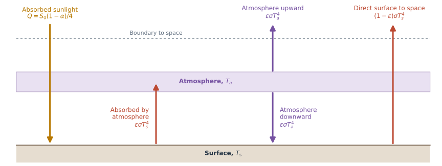
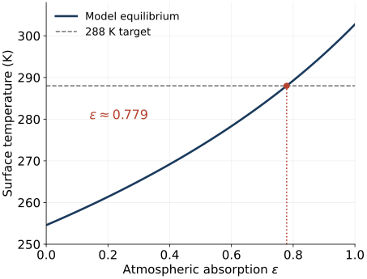
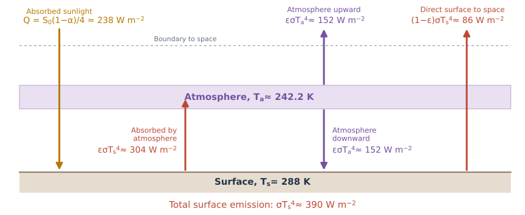
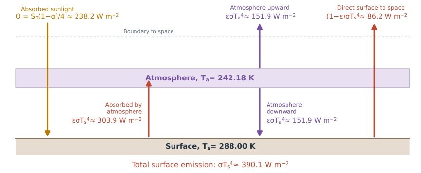
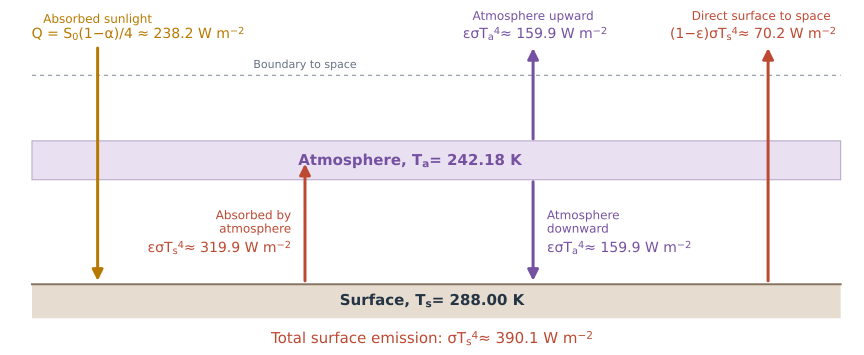
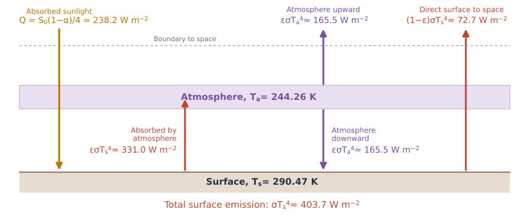
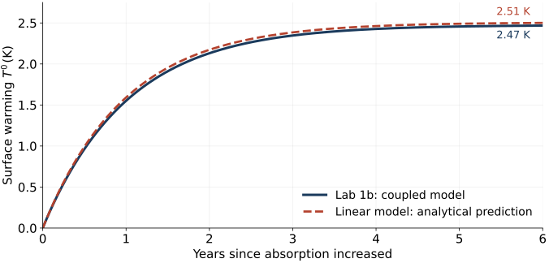
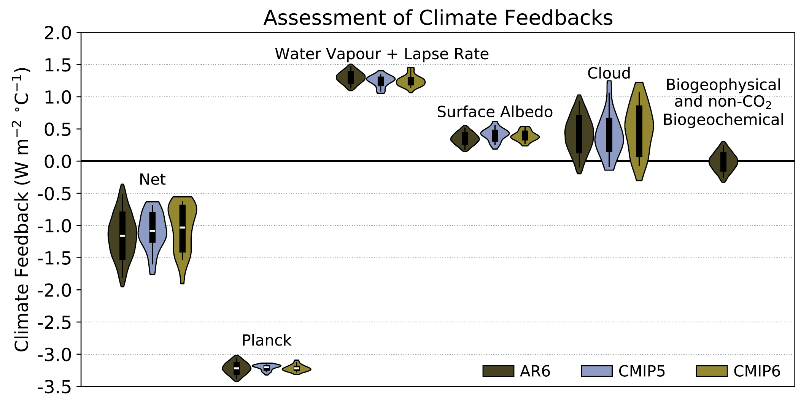
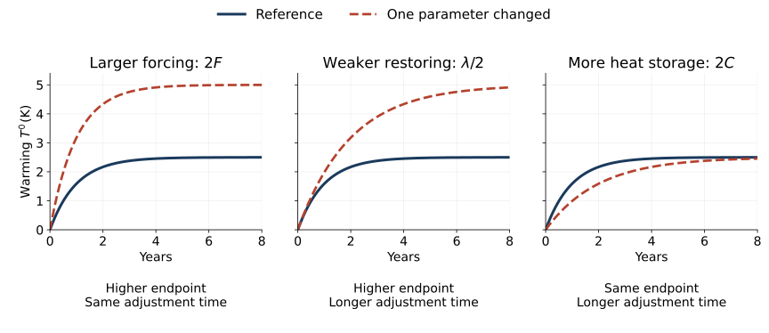

## The models from last week {#our-surface-and-atmospheric-layer .ebm-intro}

::: {.partial-layer-image}
{fig-alt="General surface and one-layer radiation model. At epsilon zero, all surface infrared radiation escapes directly to space and the atmosphere neither absorbs nor emits. At epsilon one, the atmosphere absorbs all surface infrared radiation and emits upward and downward."}
:::

- $\epsilon=0$: no greenhouse absorption, $T_s\approx255\ \mathrm{K}$.
- $\epsilon=1$: a fully absorbing atmospheric layer, $T_s\approx303\ \mathrm{K}$.

::: {.prompt}
Which radiation pathways disappear in each limit?
:::

## Budgets with partial absorption {#partial-absorption-budgets .ebm-intro}

::: {.model-label}
Surface
:::

$$C_s\frac{dT_s}{dt}=Q+\epsilon\sigma T_a^4-\sigma T_s^4$$

::: {.units}
The surface still loses its **entire** emission, wherever that radiation goes.
:::

::: {.model-label}
Atmosphere
:::

$$C_a\frac{dT_a}{dt}=\epsilon\sigma T_s^4-2\epsilon\sigma T_a^4$$

::: {.units}
Only the absorbed fraction heats the layer. Emission leaves in both directions.
:::

Adding the budgets gives:

$$C_s\frac{dT_s}{dt}+C_a\frac{dT_a}{dt}
=Q-\left[(1-\epsilon)\sigma T_s^4+\epsilon\sigma T_a^4\right].$$

::: {.assumption}
The bracket is outgoing longwave radiation (**OLR**): direct surface radiation + upward atmospheric emission.
:::

## Equilibrium with partial absorption {#partial-absorption-equilibrium .ebm-intro}

Set both temperature tendencies to zero.

:::: {.columns}
::: {.column width="43%"}

For $\epsilon>0$, atmospheric balance gives

$$T_a^4=\frac{T_s^4}{2}.$$

Substitute into the surface balance:

$$Q=(1-\epsilon/2)\sigma T_s^4.$$

$$T_s=\left[\frac{Q}{\sigma(1-\epsilon/2)}\right]^{1/4}$$

:::
::: {.column width="57%"}

{width="100%" fig-alt="Equilibrium surface temperature increases with atmospheric absorption, from about 255 K at epsilon zero to 303 K at epsilon one. The curve crosses the 288 K target at epsilon approximately 0.779."}

:::
::::

::: {.assumption}
At $\epsilon=0$, the surface formula still applies, but atmospheric balance leaves $T_a$ undetermined.
:::

::: {.assumption}
Optional practice: [Lab 1a](https://dhruvbalwada.github.io/intro-climate-modeling-fall2026/labs/lab1a_equilibrium.ipynb) explores this curve and the energy budgets. Try it in your own time.
:::

## Checking the equilibrium energy budgets {#equilibrium-energy-budgets .ebm-intro}

$\epsilon\approx0.779$. Flux values are rounded to whole numbers.

{width="100%" fig-alt="Equilibrium radiation diagram. Absorbed sunlight is 238 W per square metre. Surface emission is 390, with 304 absorbed by the atmosphere and 86 escaping directly to space. The atmosphere emits 152 upward and 152 downward. Each formula precedes its value in W per square metre. The surface label gives Ts = 288 K and the atmosphere label gives Ta approximately 242.2 K."}

::: {.prompt}
Do the surface, atmosphere, and planetary budgets each balance?
:::

## A climate change experiment {#absorption-change-experiment .ebm-intro}

In this model $\epsilon$ is a parameter that represents the effect of greenhouse gases. How does this system behave if we were to "increase greenhouse gases"?

Start at equilibrium:

$$T_s=288\ \mathrm{K},\qquad T_a\approx242.2\ \mathrm{K}.$$

At $t=0$, increase absorption from $\epsilon\approx0.779$ to $\epsilon=0.82$ and hold it there.

Keep absorbed sunlight $Q$ and both heat capacities unchanged.

::: {.prompt}
Before running the model (Lab 1b):  
- What will happen to the temperature?  
- Do temperatures change immediately?  
- Which radiation fluxes change immediately?  
- Does the planet initially gain or lose energy?  
- What role do the heat capacities play? 
:::

# Lab 1b · Adjustment over time {#lab-1b-adjustment background-color="#1a3a5c"}

## Radiation changes first; temperatures then adjust {#adjustment-summary .ebm-intro}

:::: {.r-stack}
::: {.fragment .fade-out .adjustment-stage data-fragment-index="0"}

**1. Old equilibrium** · $\epsilon\approx0.779$

{fig-alt="Old equilibrium: surface 288 K, atmosphere 242.18 K. Sunlight 238.2, surface emission 390.1, atmospheric absorption 303.9, direct escape 86.2, and atmospheric emission 151.9 in each direction, all fluxes in W per square metre."}

$\mathrm{OLR}=Q\approx238.2\ \mathrm{W\,m^{-2}},\qquad N=0.$

Both reservoirs are in balance.

:::
::: {.fragment .current-visible .adjustment-stage data-fragment-index="0"}

**2. Immediately after the change** · $\epsilon=0.82$

{fig-alt="Immediately after absorption increases, temperatures remain 288 K and 242.18 K. Surface emission remains 390.1. Atmospheric absorption increases to 319.9, emission to 159.9 each way, and direct escape falls to 70.2 W per square metre. OLR falls to 230.2."}

$\mathrm{OLR}\approx230.2\ \mathrm{W\,m^{-2}},\qquad N\approx+8.0\ \mathrm{W\,m^{-2}}.$

Temperatures have not changed. The surface gains energy; the atmosphere is initially balanced.

:::
::: {.fragment .fade-in .adjustment-stage data-fragment-index="1"}

**3. New equilibrium** · $\epsilon=0.82$

{fig-alt="New equilibrium: surface 290.47 K, atmosphere 244.26 K. Surface emission is 403.7, atmospheric absorption 331.0, direct escape 72.7, and atmospheric emission 165.5 each way in W per square metre. OLR returns to 238.2, matching sunlight."}

$\mathrm{OLR}=Q\approx238.2\ \mathrm{W\,m^{-2}},\qquad N=0.$

Both temperatures are higher. Total OLR returns to its original value; its components differ.

:::
::::

$N=Q-\mathrm{OLR}$. Flux labels are rounded; arrow widths are schematic.

## Interpreting the coupled model {#why-simplify-adjustment .ebm-intro}

$$C_s\frac{dT_s}{dt}=Q+\epsilon\sigma T_a^4-\sigma T_s^4$$

$$C_a\frac{dT_a}{dt}=\epsilon\sigma T_s^4-2\epsilon\sigma T_a^4$$

The lab solved these coupled, nonlinear equations numerically. A simple analytical description of their time evolution is harder to obtain.

**What sets the amount of warming and the adjustment time?**

As models grow more complex, interpreting their responses becomes harder too.

::: {.prompt}
We will derive a **linear energy-balance model** to separate the roles of forcing, radiative restoring, and heat storage.
:::

## A rapidly adjusting atmosphere {#fast-atmosphere-reduction .ebm-intro}

**Assumption:** the atmosphere adjusts much faster than the surface.
Neglecting atmospheric heat storage, its budget stays approximately balanced:

$$T_a^4\approx\frac{T_s^4}{2}\qquad(\epsilon>0).$$

$T_a$ follows $T_s$ as the surface warms.

We now evolve just one temperature:

$$C_s\frac{dT_s}{dt}=Q-\mathrm{OLR}.$$

The OLR defined in the earlier slides simplifies to

$$\mathrm{OLR}=\left(1-\frac{\epsilon}{2}\right)\sigma T_s^4.$$

::: {.prompt}
The greenhouse effect is retained in OLR. The radiation law is still nonlinear.
:::

## Linearizing the radiation response {#linearizing-radiation .ebm-intro}

If we think in terms of small changes around a mean state, we can obtain useful framework ("model") to think about the system. 

After the step, hold $\epsilon_1=0.82$ fixed.

Measure warming from the **old equilibrium**, $T_{s0}=288\ \mathrm{K}$:

$$T'=T_s-T_{s0}.$$

For small warming, approximate the radiation response as

$$\mathrm{OLR}\approx\mathrm{OLR}(0^+)+\lambda T'.$$

- $\mathrm{OLR}(0^+)$: outgoing radiation **immediately after changing $\epsilon$** (forcing), before temperatures change.
- $\lambda$: the increase in OLR per degree of warming, in $\mathrm{W\,m^{-2}\,K^{-1}}$.

::: {.assumption}
Here $\lambda>0$: as the surface and atmosphere warm, more energy escapes to space.
:::

## Forcing and radiative restoring {#forcing-and-restoring .ebm-intro}

**Forcing:** the initial imbalance caused by changing $\epsilon$.

$$F=Q-\mathrm{OLR}(0^+).$$

::: {.units}
$Q$ is unchanged in our experiment; $F$ has units of $\mathrm{W\,m^{-2}}$.
:::

Substitute the linearized OLR into the energy budget:

$$C_s\frac{dT'}{dt}=Q-\mathrm{OLR}\approx F-\lambda T'.$$

**Radiative restoring:** $\lambda T'$ is the increase in outgoing radiation as temperatures rise, reducing the imbalance.

::: {.prompt}
We started with a **nonlinear equation for $T_s$**. After these approximations, we have a **linear equation for the warming, $T'=T_s-T_{s0}$**, which we can solve analytically.
:::

## What sets forcing and restoring in our model? {#forcing-restoring-dependencies .ebm-intro}

$$F=\frac{\Delta\epsilon}{2}\sigma T_{s0}^4,
\qquad\Delta\epsilon=\epsilon_1-\epsilon_0.$$

Forcing depends on the **size of the absorption change** and the **initial temperature**.

$$\lambda=4\left(1-\frac{\epsilon_1}{2}\right)\sigma T_{s0}^3.$$

Restoring strength depends on the **new absorption** and the **temperature around which we linearize**.

::: {.assumption}
This temperature-only restoring response is **analogous to the Planck feedback**: warming increases radiation to space. In our sign convention, $\lambda>0$ is stabilizing.
:::

::: {.prompt}
Here we can calculate these coefficients explicitly. In more complex models, they summarize the combined effects of many processes.
:::

## How much warming, and how quickly? {#warming-and-adjustment-time .ebm-intro}

For constant $F$, $\lambda$, and $C_s$, starting from $T'(0)=0$, the linear model has the solution

$$T'(t)=\frac{F}{\lambda}\left(1-e^{-t/\tau}\right),
\qquad \tau=\frac{C_s}{\lambda}.$$

**Equilibrium warming:** as $t\to\infty$,

$$T'_{\mathrm{eq}}=\frac{F}{\lambda}.$$

**Adjustment time:** $\tau=C_s/\lambda$ sets how quickly warming approaches that endpoint.

After one $\tau$, about **63%** of the equilibrium warming has occurred.

::: {.prompt}
As in Lab 1b: larger heat capacity slows warming without changing the equilibrium temperature.
:::

## How well does the simpler model work? {#analytical-lab-comparison .ebm-intro}

**No fitting:** use the parameters from Lab 1b to calculate

::: {.units}
$F\approx8.01\ \mathrm{W\,m^{-2}}$, $\lambda\approx3.20\ \mathrm{W\,m^{-2}\,K^{-1}}$, and $\tau\approx0.99$ years.
:::

{height="340" fig-alt="Surface warming after the absorption step. The Lab 1b coupled model and the analytical linear model follow closely overlapping curves, approaching 2.47 and 2.51 kelvin respectively. Their largest difference is about 0.04 kelvin. No parameters were fitted to the temperature trajectory."}

::: {.assumption}
For more complex responses, fitting this form estimates $T'_{\mathrm{eq}}$ and $\tau$. Independently known forcing is needed to infer $\lambda$ and $C_s$ from those fitted values.
:::

## A simple framework for a complex climate {#climate-response-framework .ebm-intro}

$$C\frac{dT'}{dt}\approx N\approx F-\lambda T'.$$

::: {.units}
[IPCC Chapter 7, Box 7.1](https://www.ipcc.ch/report/ar6/wg1/chapter/chapter-7/) uses the same forcing–feedback relation: $\Delta N=\Delta F+\alpha\Delta T$. Their feedback parameter $\alpha=-\lambda$.
:::

- **$F$: imposed radiative forcing.** Greenhouse gases, aerosols, solar changes, and other contributions combine and can vary over time.
- **$\lambda$: net radiative feedback.** Thermal emission, water vapor, clouds, and snow and ice albedo affect outgoing radiation and absorbed sunlight. Contributions can amplify or oppose warming; our **positive net $\lambda$ restores balance**.
- **$C$: effective heat capacity.** Heat storage, especially in the oceans, depends on how much material participates over the timescale considered.

::: {.assumption}
The single heat reservoir, $C\,dT'/dt$, is an additional approximation. Real climate can have several adjustment times and changing feedbacks.
:::

## Energy imbalance and heat storage {#planetary-energy-storage .ebm-intro}

At the top of the atmosphere, **absorbed sunlight minus outgoing longwave radiation** gives the net energy input:

$$N=Q-\mathrm{OLR}\qquad(\mathrm{W\,m^{-2}}).$$

**$N>0$:** more energy enters than leaves, so the planet accumulates energy.

The IPCC uses $\Delta N=N-N_0$, the change from a reference state. Our initial state is in equilibrium: $N_0=0$, so **$\Delta N=N$**.

If $E$ is stored energy per unit area,

$$\frac{dE}{dt}=N.
\qquad\text{Our one-reservoir model:}\quad N=C\frac{dT'}{dt}.$$

::: {.prompt}
Energy imbalance is the **rate of energy accumulation** in $\mathrm{W\,m^{-2}}$. Accumulated energy is measured in $\mathrm{J\,m^{-2}}$.
:::

## Climate feedbacks in the IPCC assessment {#ipcc-feedback-preview .ebm-intro}

{height="390" fig-alt="IPCC AR6 Figure 7.10 compares assessed climate feedbacks with CMIP5 and CMIP6 model estimates. In the IPCC sign convention, the Planck response is strongly negative, water vapor plus lapse rate, surface albedo, and clouds are positive on average, and the net feedback is negative but weaker than the Planck response alone."}

::: {.units}
[IPCC AR6 WGI, Figure 7.10](https://www.ipcc.ch/report/ar6/wg1/figures/chapter-7/figure-7-10/) · Forster et al. (2021). The figure uses $\alpha$: **negative is stabilizing**. Our $\lambda=-\alpha$.
:::

::: {.prompt}
Why is the net restoring weaker than the Planck response alone? What would that imply for equilibrium warming?
:::

## Equilibrium climate sensitivity {#equilibrium-climate-sensitivity .ebm-intro}

How much equilibrium warming results from the **same imposed forcing**?

$$T'_{\mathrm{eq}}=\frac{F}{\lambda}.$$

**Equilibrium climate sensitivity (ECS)** is the equilibrium global surface warming after CO$_2$ doubles and is held fixed.

In this linear framework,

$$\mathrm{ECS}=\frac{F_{2\times\mathrm{CO_2}}}{\lambda},
\qquad \tau=\frac{C}{\lambda}.$$

::: {.prompt}
For the same forcing and heat capacity, weaker restoring means **more equilibrium warming** and a **longer adjustment time**.
:::

::: {.units}
ECS describes the eventual warming; $\tau$ describes the pace of approach in this model. [IPCC AR6, Chapter 7](https://www.ipcc.ch/report/ar6/wg1/chapter/chapter-7/)
:::

## How do the warming curves change? {#climate-parameter-comparison .ebm-intro}

Change one coefficient at a time; hold the other two fixed. Each experiment starts with a constant forcing step.

{width="100%" fig-alt="Three comparisons with the same reference warming curve. Doubling forcing doubles equilibrium warming without changing the adjustment time. Halving the positive restoring coefficient doubles both equilibrium warming and the adjustment time. Doubling heat capacity doubles the adjustment time without changing equilibrium warming."}

::: {.units}
Illustrative reference: $F=8\ \mathrm{W\,m^{-2}}$, $\lambda=3.2\ \mathrm{W\,m^{-2}\,K^{-1}}$, $C=10^8\ \mathrm{J\,m^{-2}\,K^{-1}}$.
:::

<!-- Reintroduce topics/_week03_surface_heat_capacity.qmd after developing the analytical adjustment timescale. -->
